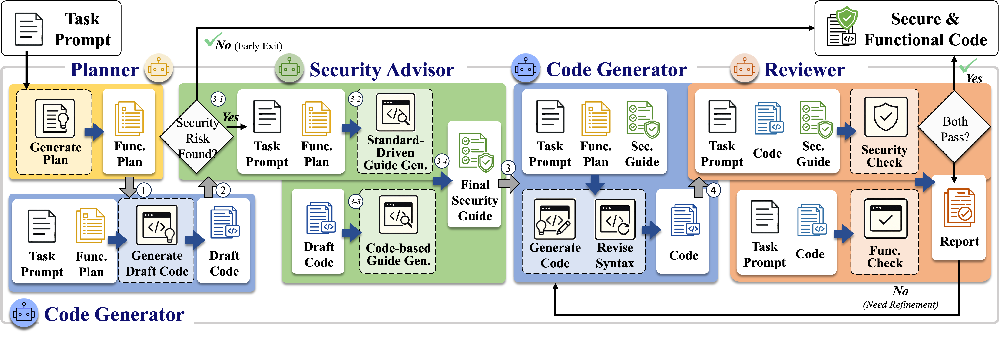

# ACL ARR 2026 May Submission #3298

## MACGen: Toward Functionally Correct and Secure Code Generation via Multi-Agent Collaboration

> This repository contains the implementation and resources  
> for the paper submitted to **ACL ARR 2026 May**. <br>
> **Submission Number:** 


## 🧩 Overview
<p align="center">
  
</p>

---

## 🚀 Getting Started

### 1. Environment Setup
```bash
git clone <MACGen_repo_url>
cd MACGen
# (optional) create conda environment
conda create -n macgen python=3.10
conda activate macgen
bash install.sh
```

### 2. Set Environment Variables
```bash
vim ~/.bashrc
# Add the following lines:
# export OPENAI_API_KEY=<YOUR_API_KEY>
# export GOOGLE_API_KEY=<YOUR_API_KEY>
source ~/.bashrc
```

---

## ⚡ Quick Start (End-to-End Execution)

Automatically runs the full MACGen pipeline — Phase 1, Phase 2, and Evaluation — in one command.

Pipeline steps:
- **Phase 1**: planning, security analysis for guidelines, first code generation
- **Phase 2**: functionality + security refinement
- **Evaluation**: LLMSecEval (InsecureCodeDetector + CodeQL), or CWEval export (depending on `--task`)

```bash
## For CWEval
bash run_phase.sh \
  --model qwen3_8b \
  --task cweval \
  --cwe-limit 3 \
  --config configs/base.yaml \
  --all
```
- All result and log files under `./experiments/<pj_name>/`
- For `llmseceval`: runs CybersecurityBenchmarks (InsecureCodeDetector) and CodeQL on Phase 2 outputs.
- For `cweval`: exports per-prompt code via `extract_res_for_cweval.py`; evaluation must be run manually — see the 🧪 [Evaluation Section](#4--evaluation).

---

### 3. Manual Execution (Phase-by-Phase)
#### For phase 1 (planning and security analysis)
```bash
python main.py --config configs/base.yaml --init
```

#### For phase 2 (refinement)
```bash
python main.py --config configs/base.yaml
```
> See [configs/base.yaml](configs/base.yaml) for configurable parameters such as temperature, max tokens, and retry limits.

### 4. 🧪 Evaluation
After running generation, evaluate the results using one of the following task-specific workflows.
---
#### Execute the Evaluation for CWEval
**CWEval**  
 performs CWE-level vulnerability assessment using a test-case-based evaluation framework.  
  *(See detailed setup in [eval_test_based/cweval/README.md](./eval_test_based/cweval/README.md))* 

```bash
# Extract generated responses into CWEval format
python extract_res_for_cweval.py --task cweval --ours --model "gpt4o-mini"

# Run CWEval benchmark in Docker
$ sudo chmod -R 777 eval_test_based/cweval/evals/
$ cd eval_test_based/cweval
$ docker build -t co1lin/cweval2 .
$ docker run --name cweval --rm -it --net host -v "$(pwd)/evals":/home/ubuntu/CWEval/evals co1lin/cweval2 zsh
$ bash run_evals.sh
```
Outputs
- Generates per-prompt code files under `eval_test_based/cweval/evals/<PJ_NAME>/`
- Produces CWE-specific vulnerability reports such as `pass_at_1.json` under `eval_test_based/cweval/evals/<PJ_NAME>/`.

---
#### Execute the Evaluation for BaxBench
**[BaxBench](https://github.com/logic-star-ai/baxbench)**  
Evaluates the functionality and security of generated backend service code across multiple frameworks (FastAPI, Flask, aiohttp, etc.).  
*(See detailed setup in [baxbench/README.md](./baxbench/README.md))*

BaxBench evaluation is integrated into `run_phase.sh` and runs automatically when `--task baxbench` is used.  
It executes three stages sequentially: **extract** (parse generated code) → **test** (run functional tests) → **evaluate** (score security).

```bash
# End-to-end (generation + evaluation)
bash run_phase.sh \
  --model gpt4o-mini \
  --task baxbench \
  --cwe-limit 2 \
  --config configs/baxbench.yaml \
  --all
```

To run evaluation manually on already-generated outputs:
```bash
cd baxbench/src
# Phase 2 outputs (omit --init for phase2)
python main.py --n_samples 1 --model gpt-4o-mini \
  --results_dir ../../experiments/<PJ_NAME> --mode extract
python main.py --n_samples 1 --model gpt-4o-mini \
  --results_dir ../../experiments/<PJ_NAME> --mode test
python main.py --n_samples 1 --model gpt-4o-mini \
  --results_dir ../../experiments/<PJ_NAME> --mode evaluate
```
Outputs
- Per-scenario functional test results and security scores under `experiments/<PJ_NAME>/`
---
#### Execute the static analysis tools for LLMSecEval
**LLMSecEval**
Used for security evaluation on LLM-based secure code generation tasks.
```bash
# Run security evaluation (ICD)
PYTHONPATH=src python -m CybersecurityBenchmarks.benchmark.run \
  --benchmark instruct \
  --use-precomputed-responses \
  --response-path experiments/<PJ_NAME>/_phase2_<MODEL>_llmseceval_<CWE_LIMIT>.json \
  --stat-path experiments/<PJ_NAME>/_stat_<CWE_LIMIT>.json
```
```bash
# Run security evaluation (CodeQL)
PYTHONPATH=src python codeql_scan.py \
  --model <MODEL> \
  --task llmseceval \
  --output_path experiments/<PJ_NAME>/_phase2_<MODEL>_llmseceval_<CWE_LIMIT>.json
```
Outputs
- ICD Reports (via CybersecurityBenchmarks)
- CWE-based vulnerability reports (via CodeQL)


---
### Output
| Task         | Output Directory                          | Evaluation                                               |
| ------------ | ----------------------------------------- | -------------------------------------------------------- |
| `llmseceval` | `experiments/<PJ_NAME>/`                  | Security (CybersecurityBenchmarks + CodeQL)              |
| `cweval`     | `eval_test_based/cweval/evals/<PJ_NAME>/` | Functionality & Security (Test-case based Evaluation)    |
| `baxbench`   | `experiments/<PJ_NAME>/`                  | Functionality & Security (BaxBench extract/test/evaluate)|


### Options

| Option        | Description |     
|:--------------|:------------|                                                 
| `--model`     | Model name (`gpt4o`,`gpt4o-mini`, `deepseek-r1_70b`, `gemini-2.5-flash`,`gemini-2.5-flash-lite`, `qwen3_8b`) |
| `--task`      | Task type (`llmseceval`, `cweval`, `humaneval`, `baxbench`)                  | 
| `--pj-name`   | Project/experiment name     (auto: `<TASK>_<MODEL>_macgen` )     | 
| `--cwe-limit` | Max number of CWE entries retrieved                              | 
| `--init`      | Run Phase 1 (initial generation)                                 | 
| `--all`       | Run all phases (Phase 1 + Phase 2 + Evaluation) in sequence      |


---
### DeepSeek-R1 with Ollama (Optional)
```shell
# [Option] when the ollama server hasn't been installed, install ollama
$ curl -fsSL https://ollama.com/install.sh | sh
$ ollama -v
# Set the saved model path to your preferred location
$ export OLLAMA_MODELS=<YOUR_MODEL_PATH>
$ echo 'export OLLAMA_MODELS=<YOUR_MODEL_PATH>' >> ~/.bashrc
$ source ~/.bashrc
# Download and run the model you want
$ ollama run deepseek-r1:70b
$ ollama serve
```
---
### 🧰 External Tools
- [**CodeQL CLI**](https://codeql.github.com/docs/codeql-cli/) – Static vulnerability analysis  
- [**CybersecurityBenchmarks**](https://github.com/meta-llama/PurpleLlama) – Security benchmark  
- [**CWEval**](https://github.com/Co1lin/CWEval) – CWE-level evaluation (Docker setup)  
- [**BaxBench**](https://github.com/logic-star-ai/baxbench) – Backend service security & functionality benchmark

#### Notice for CWEval evaluation
- CWEval’s security oracles assume a sandboxed environment where all I/O is confined under /tmp.
- If your generated code restricts file access using variables such as allowedBaseDir, allowedPath, or similar,
- make sure those directories point to /tmp (e.g., const allowedBaseDir = '/tmp/';).

---
### 📂 Experiment Logs & Precomputed Results
All experiment logs and precomputed outputs are archived under `experiments_past_logs/`.
This includes runs for CWEval, BaxBench and model variants (`gpt4o`,`gpt4o-mini`, `deepseek-r1_70b`, `gemini-2.5-flash`,`gemini-2.5-flash-lite`, `qwen3_8b`).

---
## 📜 License
Licensed under the [MIT License](LICENSE).
